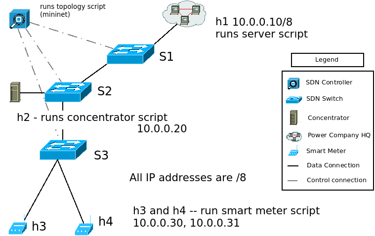

# Topology Visualization of SDN based Smart Grid Networks
A prototype network for visualizing SDN based smart grid.

A project done as partial requirement for fulfilling the course [*ICT Support for Adaptiveness and (Cyber)security in the Smart Grid  DAT300*] (http://www.cse.chalmers.se/edu/year/2015/course/DAT300/ "Course homepage")  
